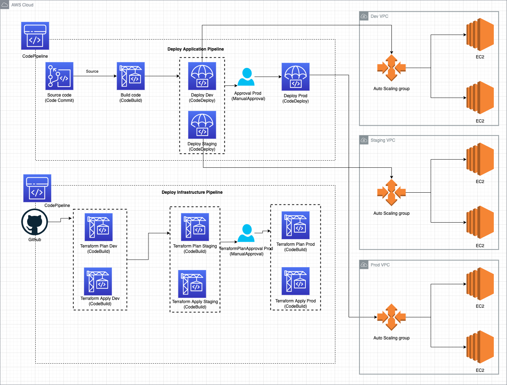

https://github.com/ibrahima92/fullstack-typescript-mern-todo

aws codepipeline list-webhooks
https://faun.pub/terraform-deployments-with-aws-codepipeline-342074248843

brew install kreuzwerker/taps/m1-terraform-provider-helper
m1-terraform-provider-helper activate
m1-terraform-provider-helper install hashicorp/template -v v2.2.0

aws --region ap-southeast-1 deploy push \
    --application-name Sample_App \
    --s3-location s3://viet-aws-codepipeline-front-end-kweyqpci/SampleApp.zip

aws --region  ap-southeast-1 deploy create-deployment \
    --application-name Sample_App \
    --deployment-config-name CodeDeployDefault.AllAtOnce \
    --deployment-group-name Sample_DepGroup \
    --s3-location bucket=viet-aws-codepipeline-front-end-kweyqpci,bundleType=zip,key=SampleApp.zip

export REGION=ap-southeast-1
export TF_S3_BACKEND_BUCKET=827539266883-terraform-backend-devops-dev
export TF_S3_BACKEND_BUCKET_PATH=dev
export STAGE=dev